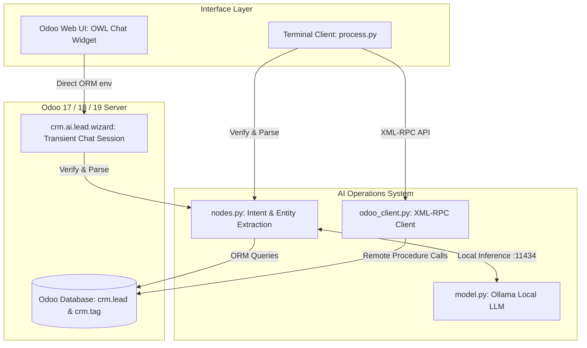

# 🤖 Odoo CRM AI Lead Assistant

An intelligent, privacy-first conversational assistant integrated directly into **Odoo CRM** (`crm.lead`). It allows sales teams and real estate agents to **create**, **update**, and **delete** leads using natural language—either through a native in-app chat widget or a headless terminal client.

Powered by local Large Language Models via **Ollama** (`qwen2.5:7b`), ensuring **100% data privacy**, zero external API costs, and instant on-premise execution.

---

## 🌟 Key Features

- 💬 **Natural Language CRM Operations**: Perform complete lead management workflows by simply chatting in natural language (e.g., *"Add Omar, wants to buy a villa in Casablanca, high priority, phone 0612345678"*).
- 🏘️ **Real Estate Domain Awareness**: Automatically classifies operations (`buy`, `sell`, `rent`) and property types (`villa`, `house`, `apartment`), converting them into real Odoo CRM tags (`crm.tag`).
- ⚡ **Multi-Lead Batch Extraction**: Detects and extracts multiple distinct customers mentioned in a single prompt and creates all of them simultaneously.
- 🔄 **Conversational Slot-Filling & Clarification Queue**: If a message describes customer requirements without providing a name (the only mandatory field), the assistant remembers the extracted details and prompts specifically for the missing name.
- 🛡️ **Anti-Hallucination & Deterministic Execution**: The LLM never hallucinates record IDs or guesses database matches. Instead, it extracts search criteria, and real Odoo database queries handle the lookup and execution.
- 🖥️ **Dual Execution Modes**:
  - **Embedded Odoo Web Interface**: Native OWL chat interface with an animated typing indicator, accessible via a **"New Lead AI"** button on the CRM Leads list.
  - **Headless Terminal Client (`process.py`)**: Standalone interactive terminal runner communicating via XML-RPC for testing and automation outside the browser.
- 🔒 **100% Local & Private**: No customer contact details or notes leave your local infrastructure.

---

## 🏗️ Architecture & Workflow



### Why Dual Execution Paths?
1. **Inside Odoo (Web Client)**: The wizard uses Odoo's internal ORM (`self.env['crm.lead']`) within the current database transaction. This eliminates cross-transaction race conditions and ensures immediate UI synchronization.
2. **Outside Odoo (CLI / Headless)**: `odoo_client.py` uses XML-RPC to authenticate and interact with Odoo externally using user credentials or API keys.

---

## 📂 Project Structure

```text
CRM system/
├── crm_ai_lead/                         # Odoo Custom Addon Module
│   ├── __init__.py
│   ├── __manifest__.py                  # Module manifest and dependencies ('crm')
│   ├── models/
│   │   ├── __init__.py
│   │   └── crm_ai_lead_wizard.py        # Transient models for chat session & message history
│   ├── security/
│   │   └── ir.model.access.csv          # Access control rights for wizard models
│   ├── static/
│   │   └── src/
│   │       ├── views/                   # Custom list view extension & "New Lead AI" button
│   │       │   ├── list.js
│   │       │   └── list.xml
│   │       └── wizard/                  # OWL chat component, templates, and styles
│   │           ├── chat.js
│   │           ├── chat.xml
│   │           └── chat.css
│   └── views/
│       ├── crm_ai_lead_wizard_views.xml # Wizard form view and window action
│       └── crm_lead_views.xml           # CRM Lead list view inheritance
│
├── AI operations system/                # Standalone AI Logic & External Client
│   ├── .env                             # Environment credentials for XML-RPC
│   ├── model.py                         # Ollama LLM integration wrapper
│   ├── nodes.py                         # NLP prompt pipelines, slot filling, & CRM actions
│   ├── odoo_client.py                   # XML-RPC communication client for headless usage
│   └── process.py                       # Interactive terminal chat client
│
├── .env                                 # Root environment configuration
└── CRM_AI_Lead_Assistant_Spec.pdf       # Original architectural & functional specification
```

---

## 📋 Supported Fields & Data Mapping

The assistant extracts and maps entities from natural language into the following Odoo `crm.lead` fields:

| Entity / Field | Type / Values | Odoo CRM Field | Required? | Notes |
| :--- | :--- | :--- | :---: | :--- |
| **Customer Name** | String | `name`, `contact_name` | **Yes** | The only mandatory field. Prompts if missing. |
| **Operation Tag** | `buy`, `sell`, `rent` | `tag_ids` (`crm.tag`) | No | Stored as a tag (e.g., `Buy`). Created if not existing. |
| **Property Type** | `villa`, `house`, `apartment` | `tag_ids` (`crm.tag`) | No | Stored as a tag (e.g., `Villa`). |
| **Priority** | `0` to `3` | `priority` | No | Mapped from terms like "urgent", "high priority", "2 stars". |
| **Email** | Valid email | `email_from` | No | Extracted when mentioned. |
| **Phone** | Phone string | `phone` | No | Extracted when mentioned. |
| **Company** | String | `partner_name` | No | Associated company name. |
| **Address** | Street, City, Country | `street`, `city`, `country_id` | No | Country is matched against `res.country`. |
| **Website** | URL | `website` | No | Extracted when mentioned. |
| **Notes** | Free text | `description` | No | Captures budgets, timelines, preferences, etc. |

---

## 💬 Usage Examples

### 1. Creating Leads (Single & Multiple)
- **Single Lead with Details:**
  > *"Add a lead for Sarah Jenkins, looking to rent a 2-bedroom apartment in Madrid, phone +34 612 345 678, high priority."*
- **Batch Creation:**
  > *"Register two clients: Ahmed wanting to buy a villa in Dubai, and Karim wanting to sell a house, priority 3 stars."*

### 2. Conversational Slot-Filling (Missing Name)
- **User:** *"I have a client interested in buying an apartment in Paris."*
- **Assistant:** *"What's the name of the customer (wants to buy apartment in Paris)?"*
- **User:** *"His name is Julien Dupont, email julien@example.com."*
- **Assistant:** *"Created lead for: #48 Julien Dupont (buy apartment, in Paris)."*

### 3. Updating Existing Leads
- **Update by Name:**
  > *"Change Ahmed's phone number to +971 50 123 4567."*
- **Update by Criteria:**
  > *"Set all leads looking to buy a villa to high priority."*

### 4. Deleting Leads
- **Delete by Name:**
  > *"Delete the lead for Julien Dupont."*
- **Delete by Criteria:**
  > *"Delete whoever wants to sell an apartment."*

---

## 🚀 Installation & Setup

### 1. Prerequisites
- **Python 3.10+**
- **Odoo** (v17, v18, or v19) with the `crm` module installed
- **Ollama** installed on your system ([ollama.com](https://ollama.com))

### 2. Install & Start the LLM
Download and run the recommended model:
```bash
ollama run qwen2.5:7b
```
Ensure the Ollama service is running on `http://localhost:11434`.

### 3. Install Python Dependencies
Install `requests` if not already installed in your Python / Odoo environment:
```bash
pip install requests
```

### 4. Configure Environment Variables
Create a `.env` file in the root or `AI operations system/` directory (or set environment variables):
```env
ODOO_URL=http://localhost:8069
ODOO_DB=your_database_name
ODOO_USERNAME=your_email@example.com
ODOO_PASSWORD=your_odoo_password_or_api_key
```

> **Note on Authentication:** For Odoo 14+, you can use an **API Key** generated from your User Profile (Preferences ➔ Account Security ➔ Developer API Keys) as `ODOO_PASSWORD`.

### 5. Install the Odoo Module
1. Copy or link `crm_ai_lead` into your Odoo custom addons directory:
   ```text
   odoo-custom-addons/
   └── crm_ai_lead/
   ```
2. Add the custom addons path to your `odoo.conf` file:
   ```ini
   addons_path = /path/to/odoo/addons,/path/to/odoo-custom-addons
   ```
3. Restart your Odoo server.
4. In Odoo, activate **Developer Mode**, navigate to **Apps ➔ Update Apps List**, search for **CRM AI Lead Assistant**, and click **Activate**.

---

## 🖥️ Running the Terminal Client

For headless testing, CI/CD, or terminal workflows:
```bash
cd "AI operations system"
python process.py
```
Type any prompt (e.g., *"Create a lead for John Doe to rent a house"*) to watch the assistant parse your message, resolve missing fields, and interact with your Odoo database in real time.

---

## 🛡️ License

This project is released under the **LGPL-3** License.

